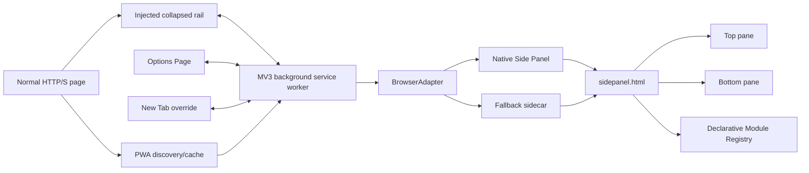
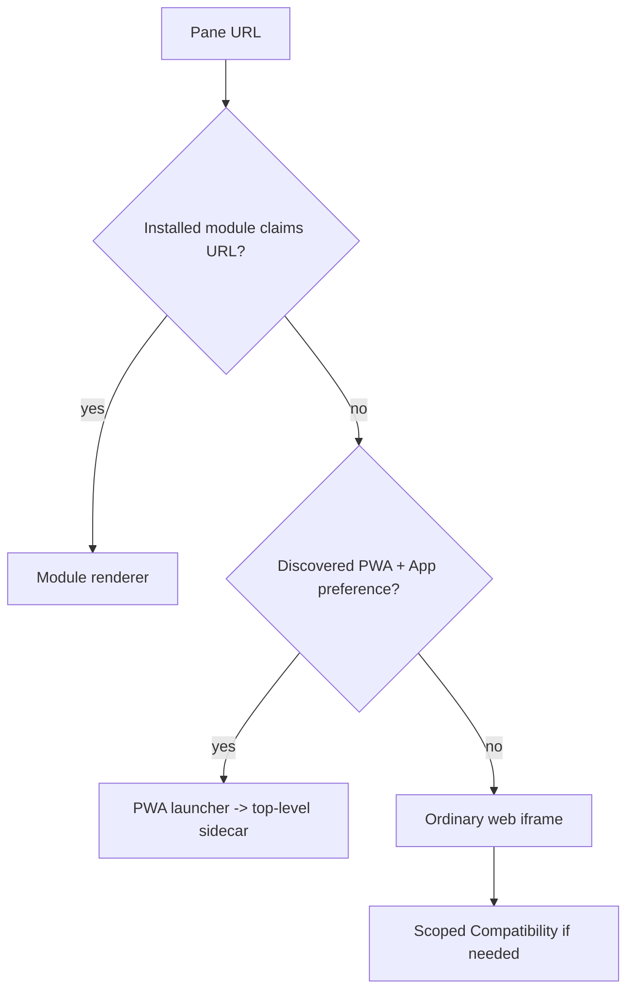

# 03 — Architecture

## High-level



## Source map

- `background.js`
  - lifecycle/orchestration
  - Side Panel open/close/collapsed state
  - workspace state
  - recent/history
  - resource sleeping
  - compatibility DNR rules
  - PWA cache and sidecars
  - sync
  - context menus
  - site settings / notifications

- `sidepanel/`
  - primary two-pane UI
  - active pane, renderer, dialogs
  - shortcut/group/template interactions
  - rail inside expanded panel
  - search palette

- `content/rail.js`
  - collapsed page rail
  - visible before Side Panel is open
  - shortcuts, overflow scrolling, expand, add, organize, search, settings

- `content/embedded-frame.js`
  - interaction/navigation bridge from framed web pages to sidepanel
  - metadata used by active-pane/current-page capture

- `content/pwa-discovery.js`
  - detects `<link rel="manifest">`
  - background sanitizes and caches manifest data

- `options/`
  - browser-settings-like control plane

- `newtab/`
  - custom New Tab so App Tower can exist on a surface where content scripts
    cannot inject into the native browser NTP

- `shared/browser-adapter.js`
  - browser capability detection
  - native Side Panel vs fallback top-level sidecar
  - collapse/expand compatibility helpers

- `shared/shortcuts.js`
  - site/group/template model normalization

- `shared/workspaces.js`
  - workspace state model

- `shared/theme.js`
  - theme/accent resolution

- `shared/media-contract.js`
  - provider-neutral media state model

- `modules/`
  - declarative providers and validator/registry

## Side Panel lifecycle invariant

Where browser events exist:

```text
sidePanel.onOpened -> panel is open -> hide external collapsed rail
sidePanel.onClosed -> panel is closed -> show external collapsed rail
```

A `runtime.Port` disconnect is not sufficient evidence of closure.

For `sidePanel.open()` user activation is critical. Prefer:

```text
click handler
  -> sidePanel.open(...)
  -> async state work
```

not:

```text
click handler
  -> await storage / messaging
  -> sidePanel.open(...)  # user gesture may be gone
```

## Pane renderer priority in Auto



## Compatibility rules

DNR compatibility may remove response headers that block framing for selected
domains. It must be scoped. It is not a universal solution: authentication,
cookies, anti-bot, DRM, Permissions Policy, OAuth popup flows and site-specific
logic can still fail.

## Message bus

Important message types currently found in source:

`OPEN_PANEL`, `COLLAPSE_PANEL`, `OPEN_SITE`, `OPEN_TEMPLATE`,
`MUTATE_SHORTCUTS`, `GET/UPDATE_WINDOW_STATE`, `LIST/CREATE/RENAME/DELETE_WORKSPACE`,
`GET/RECORD_RECENT`, `PANE_LIVE`, `PANE_ACTIVITY`, `PANE_RELEASE`,
`GET_RESOURCE_STATUS`, `GET/SET_SITE_SETTINGS`, `APPLY_NOTIFICATION_SETTING`,
`GET_PWA_FOR_URL`, `OPEN_PWA_SIDECAR`, `OPEN_REAL_SIDECAR`,
`GET_SIDECARS`, `MEDIA_STATE`, `MEDIA_CLEAR`, `OPEN_OPTIONS`,
`SET_SYNC_ENABLED`.

When changing message contracts, update both sender and handler in the same
commit and add validator/tests where possible.
